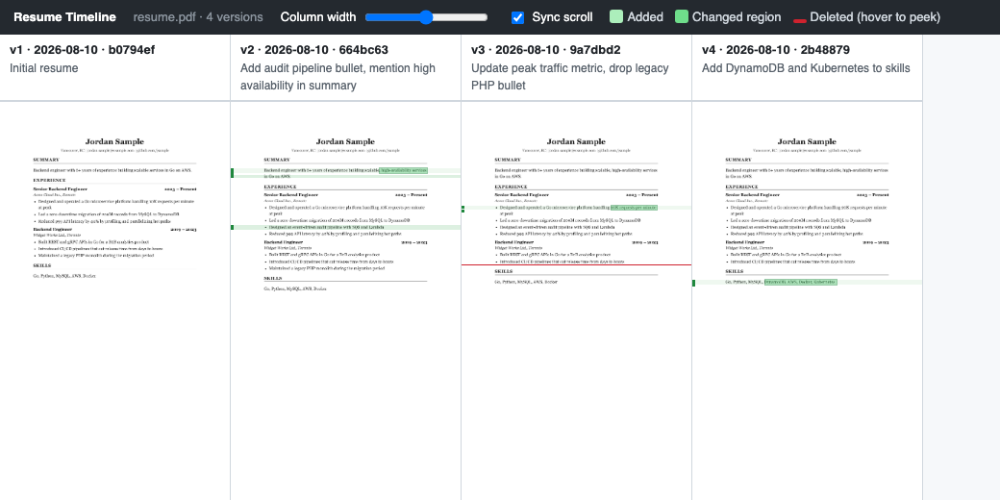

# resume-timeline

Visual diff timeline for PDF files — see how your resume evolved, version by
version, side by side.



Diff tools can show you how the *source* of your resume changed, but not how
the **rendered page** changed. `resume-timeline` takes every version of a PDF —
from your git history, or from the old files you kept in a folder — renders
them into one horizontally scrollable page (oldest → newest), and overlays
GitHub-style diff highlights directly on the page image:

- **Added lines** — light green band
- **Changed lines** — the regions that actually changed are boxed in darker green
- **Deleted lines** — red marker; hover it to peek at the removed content

Everything is emitted as a single self-contained HTML file. No server, no
dependencies at view time — just open it in a browser.

## Install

Requires Go 1.26+ and [poppler](https://poppler.freedesktop.org/) (`pdftoppm`):

```bash
brew install poppler          # macOS
sudo apt install poppler-utils  # Debian/Ubuntu

go install github.com/yuki-f-saka/resume-timeline@latest
```

`go install` puts the binary in `$(go env GOPATH)/bin` (usually `~/go/bin`).
Add that directory to your `PATH` if `resume-timeline` is not found.

Then check that everything works — this needs no git repository and no PDF of
your own:

```bash
resume-timeline -demo
open resume-timeline.html
```

It renders a built-in four-version sample resume, so it doubles as a way to
confirm poppler is installed correctly.

## Usage

Point it at a PDF in a git repository to use its commit history:

```bash
resume-timeline -file path/to/resume.pdf -out timeline.html
open timeline.html
```

No git history? Hand it the old PDFs you kept. They are placed on the timeline
in the order you list them:

```bash
resume-timeline resume_2022.pdf resume_2023.pdf resume_final.pdf
resume-timeline old-resumes/*.pdf          # shell glob, so name order
```

Or let it take a whole directory. File names like `resume_final2.pdf` say
nothing reliable about order, so the modification time decides it (ties broken
by name):

```bash
resume-timeline -dir old-resumes/
```

Either way it prints the order it settled on before doing any rendering, so you
can interrupt and list the files explicitly if it guessed wrong.

Exactly one input may be given — `-file`, `-dir`, `-demo`, or file arguments.

**Flags must come before file arguments** (`-out x.html a.pdf b.pdf`, not
`a.pdf b.pdf -out x.html`); Go's flag parser stops at the first argument.

| Flag | Default | Description |
|---|---|---|
| `-file` | | PDF file tracked in a git repository |
| `-dir` | | directory of PDF files, oldest first |
| `-demo` | `false` | render the built-in sample (no git repository needed) |
| `-out` | `resume-timeline.html` | output HTML file |
| `-limit` | `0` (all) | show only the N most recent versions |
| `-dpi` | `150` | rendering resolution |
| `-page` | `1` | PDF page to compare |

The viewer opens with the two most recent versions side by side. Drag the
column-width slider to zoom out to five or more versions at once; vertical
scrolling is synchronized across columns so corresponding lines stay aligned
(toggle it off in the toolbar).

## How it works

Diffing rendered PDFs is not a text problem — and a naive pixel diff fails
the moment one added line shifts everything below it. Instead:

1. Every version is collected — via `git log --follow` (renames are tracked)
   or straight off disk — and rasterized with `pdftoppm`.
2. Rows of ink are segmented into **bands** — horizontal strips corresponding
   to text lines — using the page's ink-density profile.
3. Adjacent versions are aligned band-by-band with an **LCS** over normalized
   band fingerprints. A line that merely moved down is matched to itself, so
   layout shifts don't pollute the diff.
4. Unmatched bands become additions/deletions; near-matches become "changed"
   lines, and a column-wise ink comparison inside each changed pair marks the
   word-level regions that actually differ.
5. Aligned pairs also get the word-level pass, so a single edited number in an
   otherwise identical line is still caught. If that pass flags most of the
   page, the two PDFs were rendered with drifted font metrics rather than
   edited, and it is skipped for that pair (reported on stdout).

The overlays are positioned in relative coordinates and drawn on top of the
page images in plain HTML/CSS.

## Limitations

- Compares one page at a time (`-page`); multi-column layouts within a page
  are handled only as full-width bands.
- Band alignment assumes horizontally stable text (no per-line reflow of the
  whole page). Works best for documents like resumes that keep a consistent
  layout between versions.

## Development

`-demo` renders the embedded sample PDFs directly and never touches git. To
exercise the git code path end to end, `./examples/demo.sh` builds a throwaway
repository from the same four samples and renders it:

```bash
./examples/demo.sh
open demo-timeline.html
```

Both should report the same per-version add/chg/del counts.

## License

[MIT](LICENSE)
